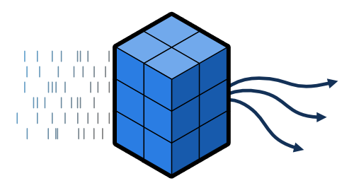

# aind-ephys-utils

[](LICENSE)

[](https://github.com/semantic-release/semantic-release)

Helpful methods for exploring *in vivo* electrophysiology data.



## Installation

```bash
pip install aind-ephys-utils
```


## Usage

All analysis happens on [Xarray](https://docs.xarray.dev/en/stable/) `DataArray` objects with labeled dimensions and coordinates, via the `ephys` accessor:
- `da.ephys.align(...)`
- `da.ephys.reduce(...)`
- `da.ephys.psth(...)`
- `da.ephys.plot.raster(...)`

This allows functions to be run in sequence and combined with built-in Xarray functions, e.g.:

```
da.ephys.align(...).sel(unit=1).mean('trial').ephys.smooth(...)
```

### NWB example

Analysis usually starts from two `DataFrames` loaded from an NWB file, one for spikes and one for trials:

```python
from aind_ephys_utils.adapters import from_dataframe
from pynwb import NWBHDF5IO

# read the file
nwb = NWBHDF5IO('/path/to/file.nwb', 'r').read()

# load units and trials dataframes
units = nwb.units.to_dataframe()
trials = nwb.trials.to_dataframe()

# align all units to all trials in a specific time window
spikes = from_dataframe(units, trials, window=(-0.5, 1.0))

# plot a spike raster for one unit, grouped by the value in the "choice" column:
ax = spikes.sel(unit=1).ephys.plot.raster(group_by="choice")

# bin the spikes in 0.01 s intervals and smooth
binned = spikes.ephys.bin(0.01).ephys.smooth(window=0.05)

# plot a PSTH for all units and conditions:
ax = binned.ephys.plot.psth()
```

### Dimensionality reduction

One of the most powerful features is the `reduce` operation, which makes it straightforward to perform dimensionality reduction on neural population data:

```python
ds = spikes.ephys.reduce(method='pca', n_components=10)

ds['projections'].shape  # (n_components, n_trials, n_timesteps)

```

The `reduce` operation currently supports seven commonly used dimensionality reduction methods:

- `'pca'`: Principal component analysis
- `'gpfa'`: Gaussian process factor analysis ([Yu et al., 2009](https://doi.org/10.1152/jn.90941.2008))
- `'dpca'`: Demixed principal component analysis ([Kobak et al., 2016](http://dx.doi.org/10.7554/eLife.10989.001))
- `'coding_direction'`: Coding direction
- `'logistic'`: Logistic regression
- `'lda'`: Linear discriminant analysis
- `'rrr'`: Reduced rank regression

### Other operations

`DataArray` objects with dimensions of `spikes`, `trials`, and/or `time` are compatible with the following operations, available via the `ephys` accessor:

- `align`: Align a `DataArray` of spike times to a `DataArray` of trial times
- `bin`: Transform a `DataArray` of spike times into a `DataArray` of binned firing rates
- `baseline`: Subtract the firing rate in a baseline interval
- `normalize`: Perform z-scoring across trials or time
- `psth`: Compute the mean across conditions
- `restrict`: Only keep data within a specified time window
- `smooth`: Smooth firing rates over time


## Contributing

### Developer installation

First, clone the repository. Then, from the `aind-ephys-utils` directory, run:

```bash
pip install -e .[dev]
```

**Note:** On macOS, you'll need to put the last argument in quotation marks: `".[dev]"`

### Linters and testing

There are several libraries used to run linters, check documentation, and run tests.

- Please test your changes using the **coverage** library, which will run the tests and log a coverage report:

```bash
coverage run -m unittest discover && coverage report
```

- Use **interrogate** to check that modules, methods, etc. have been documented thoroughly:

```bash
interrogate .
```

- Use **black** to automatically format the code into PEP standards:
```bash
black .
```

- Use **flake8** to check that code is up to standards (no unused imports, etc.):
```bash
flake8 .
```

- Use **isort** to automatically sort import statements:
```bash
isort .
```

### Pull requests

For internal members, please create a branch. For external members, please fork the repository and open a pull request from the fork. We'll primarily use [Angular](https://github.com/angular/angular/blob/main/CONTRIBUTING.md#commit) style for commit messages. Roughly, they should follow the pattern:
```text
<type>(<scope>): <short summary>
```

where scope (optional) describes the packages affected by the code changes and type (mandatory) is one of:

- **build**: Changes that affect build tools or external dependencies (example scopes: pyproject.toml, setup.py)
- **ci**: Changes to our CI configuration files and scripts (examples: .github/workflows/ci.yml)
- **docs**: Documentation only changes
- **feat**: A new feature
- **fix**: A bugfix
- **perf**: A code change that improves performance
- **refactor**: A code change that neither fixes a bug nor adds a feature
- **test**: Adding missing tests or correcting existing tests

### Documentation
To generate the rst files source files for documentation, run
```bash
sphinx-apidoc -f -e -H "API" -o docs/source/api src/aind_ephys_utils
```
Then to create the documentation HTML files, run
```bash
sphinx-build -b html docs/source/ docs/build/html
```
More info on sphinx installation can be found [here](https://www.sphinx-doc.org/en/master/usage/installation.html).


## Developing in Code Ocean

Members of the Allen Institute for Neural Dynamics can follow these steps to create a Code Ocean capsule from this repository:

1. Click the **⨁ New Capsule** button and select "Clone from AllenNeuralDynamics"
2. Type in `aind-ephys-utils` and click "Clone" (this step requires that your GitHub credentials are configured properly)
3. Select a Python base image, and optionally change the compute resources
4. Attach data to the capsule and any dependencies needed to load it (e.g. `pynwb`, `hdmf-zarr`)
5. Add plotting dependencies (e.g. `ipympl`, `plotly`)
6. Launch a Visual Studio Code cloud workstation

Inside Visual Studio Code, select "New Terminal" from the "Terminal" menu and run the following commands:

```bash
$ pip install -e .[dev]
$ git checkout -b <name of feature branch>
```

Now, you can create Jupyter notebooks in the "code" directory that can be used to test out new functions before updating the library. When prompted, install the "Python" extensions to be able to execute notebook cells.

Once you've finished writing your code and tests, run the following commands:

```bash
$ coverage run -m unittest discover && coverage report
$ interrogate . 
$ black .
$ flake8 .
$ isort .
```

Assuming all of these pass, you're ready to push your changes:

```bash
$ git add <files to add>
$ git commit -m "Commit message"
$ git push -u origin <name of feature branch>
```

After doing this, you can open a pull request on GitHub.

Note that `git` will only track files inside the `aind-ephys-utils` directory, and will ignore everything else in the capsule. You will no longer be able to commit changes to the capsule itself, which is why this workflow should only be used for developing a library, and not for performing any type of data analysis.

When you're done working, it's recommended to put the workstation on hold rather than shutting it down, in order to keep Visual Studio Code in the same state.


